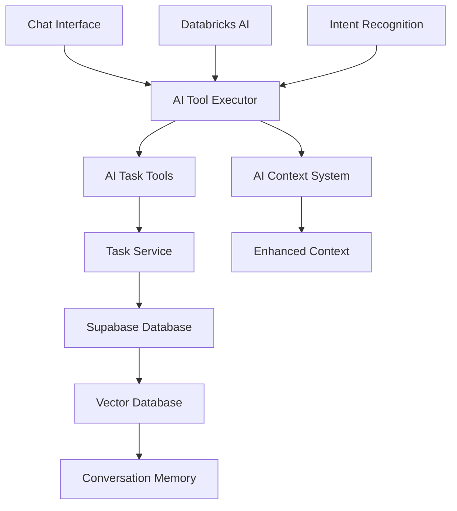

# Carole AI Personal Assistant - Memory Bank

**Project:** Carole (AI Personal Assistant)  
**Last Updated:** 2025-01-13  
**Status:** Phase 2.8.1 Complete - Landing Page Parity & UI Polish  
**Roadmap:** Reordered Jan 2025 - Vector Integration (Phase 3) prioritized over Smart Features (Phase 4)

## Memory Bank Structure

This README serves as the **single source of truth** for project context. Additional specialized context files provide deeper detail:

- **`CHANGELOG.md`** - Version history and evolution (complete migration from docs)
- **`UX-PATTERNS.md`** - Interaction design patterns and user journey flows
- **`KNOWN-ISSUES.md`** - AI implementation problems and debugging solutions
- **`ARCHITECTURE.md`** - Technical decisions, codebase analysis, and future planning (includes BOSS UI strategy)

**🚨 Critical:** The docs folder is being deprecated. All essential information has been migrated here.

---

## Product Context

### Why This Project Exists

Carole is a proactive AI personal assistant that goes beyond reactive chat interfaces to actively manage tasks, priorities, and project workflows. The system learns user patterns and provides intelligent, contextual assistance for both personal and professional task management.

### Problems It Solves

- **Task Overwhelm**: Users struggle to prioritize and manage multiple competing tasks and projects
- **Context Loss**: Traditional task managers lack conversational memory and pattern recognition
- **Passive Tools**: Existing task managers require manual input without intelligent assistance
- **Priority Confusion**: Difficulty determining what to work on when facing multiple urgent tasks

### How It Should Work

- **Proactive AI**: AI proactively presents top 3 priorities immediately on app open
- **Natural Language**: Users interact through conversation, not forms - "I finished my training"
- **Pattern Learning**: AI learns user work patterns, energy cycles, and priority preferences
- **Goal-Aware**: AI connects daily tasks to larger goals and provides strategic guidance
- **Memory-Enabled**: Full conversation history preserved with semantic search capabilities

### User Experience Goals

- **Immediate Value**: Open app → see top 3 priorities → start working
- **Conversational**: Natural language for all task operations
- **Intelligent**: AI suggests optimizations, identifies patterns, prevents conflicts
- **Trustworthy**: Never fake responses - all AI claims must be backed by real actions
- **Adaptive**: System learns and adapts to user preferences over time

---

## System Patterns

### Architecture Overview



### Core Data Flow

1. **User Input**: Natural language message in chat interface
2. **Intent Analysis**: AI analyzes semantic intent (create/update/complete/query)
3. **Context Enrichment**: AI context system provides full task state awareness
4. **Tool Execution**: AI calls appropriate task tools with extracted parameters
5. **Database Operations**: Task service performs CRUD operations on Supabase
6. **User Feedback**: Clear confirmation messages with action results
7. **Memory Storage**: Conversation and context stored for future learning

### Key Technical Decisions

#### AI-Only Approach - No Hardcoded Business Logic

**Critical Architecture Decision**: All intent recognition, data extraction, and context resolution uses LLM intelligence, not hardcoded pattern matching.

- ✅ **LLM semantic understanding**: All intent analysis through actual AI models
- ❌ **No keyword matching**: No `messageLower.includes("need to")` logic
- ❌ **No regex patterns**: No hardcoded phrase detection
- ✅ **Honest failure handling**: When AI can't understand, ask for clarification

#### Never Fake Responses - Authenticity First

- ✅ **Real Actions Only**: If AI claims to do something, it must actually do it
- ✅ **Actual Data**: All responses based on real user data and tool results
- ❌ **No Placeholders**: Never use fake data, mock responses, or simulated actions

#### Document-Driven Development

- Comprehensive documentation as "north star" for all decisions
- Plan thoroughly, document decisions, refer back consistently
- Prevents scope creep and maintains project focus

### Component Relationships

#### AI Task Tools System

- **aiTaskTools.ts**: Core AI tool functions (CRUD operations, analysis)
- **aiToolExecutor.ts**: Tool execution engine with enhanced intent analysis
- **aiContext.ts**: Basic AI context system providing task state awareness
- **aiEnhancedContext.ts**: Advanced organizational and temporal context

#### Database Layer

- **taskService.js**: Database operations layer with full CRUD capabilities
- **supabase.js**: Database connection and configuration
- **Tasks table**: Core task storage with priority, status, tags, dependencies

#### UI Components

- **ChatInterface.svelte**: Main conversational interface
- **TaskDetailModal.svelte**: Full task editing with auto-save
- **Modal.svelte**: Reusable modal component
- **BOSS UI components**: Design system components (Button, Card, Badge, Input)

### Critical Implementation Paths

#### Natural Language Task Management

1. User: "I finished my AML training"
2. Intent Analysis: Semantic recognition identifies completion intent
3. Task Identification: AI finds matching task by content similarity
4. Status Update: AI calls changeTaskStatus tool
5. Confirmation: "✅ Marked 'AML Training' as complete"

#### Task Creation Flow

1. User: "I need to update the website by Friday"
2. Intent Analysis: Identifies creation intent with due date
3. Parameter Extraction: AI extracts title, due date, priority hints
4. Task Creation: AI calls createTask tool with extracted data
5. Confirmation: "✅ Created task: 'Update website' (Due: Friday, Priority: 7)"

#### Context-Aware Suggestions

1. AI Context System: Analyzes all tasks for patterns and blockers
2. Priority Analysis: Identifies high-priority items and dependencies
3. Optimization Suggestions: "These 3 tasks need the same research - group them?"
4. Proactive Insights: "You have 2 blocked tasks that need attention"

---

## Tech Context

### Technologies & Frameworks

#### Frontend Stack

- **SvelteKit**: v2.x - Main framework with TypeScript support
- **Tailwind CSS**: v3.4.0 - Styling with custom BOSS UI design system
- **Vite**: v6.x - Build tool and development server
- **TypeScript**: v5.x - Type safety and enhanced developer experience

#### Backend & Database

- **Supabase**: PostgreSQL database with Row Level Security
- **pgvector**: Vector database extension (planned for Phase 3 conversation memory)
- **Databricks AI**: AI model endpoints (Claude 3.5 Sonnet, GPT-4o, Llama)

#### AI Integration

- **Databricks Service**: Company LLM infrastructure with PAT authentication
- **Enhanced Intent Recognition**: Semantic analysis preventing creation/completion conflicts
- **Tool Calling**: Structured AI function calling with proper error handling

### Development Environment Setup

#### Required Environment Variables

```env
# Supabase Configuration
VITE_SUPABASE_URL=https://your-project.supabase.co
VITE_SUPABASE_ANON_KEY=your_anon_key

# Databricks AI Configuration
VITE_DATABRICKS_HOST=https://databricks.internal.block.xyz
VITE_DATABRICKS_TOKEN=your_databricks_pat_token
VITE_DATABRICKS_ENV=development  # or 'production'
VITE_DEFAULT_AI_MODEL=claude-3-5-sonnet

# Development Settings
NODE_ENV=development
```

#### Key Development Commands

- `npm run dev` - Start development server (http://localhost:5173)
- `npm run build` - Build for production
- `npm run check` - TypeScript type checking
- `node test-connection-monitor.js` - Test Databricks connectivity

#### Terminal Session Management (Critical Development Pattern)

**🚨 ALWAYS maintain single terminal session during development:**

1. **Check First, Start Second**: Before starting any long-running process, check if it's already running:

   ```bash
   # Check if dev server is already running
   lsof -i :5173
   ps aux | grep -E "(vite|node.*dev)" | grep -v grep
   ```

2. **Single Terminal Session**: Use the same terminal throughout work session - don't spawn new terminals

   - First command creates new shell session
   - All subsequent commands use same shell (maintains directory, environment, running processes)

3. **Background Processes**: Run dev servers in background (`is_background: true`) to allow other commands

4. **Process Management**: Use `killall node` or targeted `pkill -f "vite dev"` if multiple instances spawn

**Why This Matters**:

- Prevents port conflicts (5173, 5174, 5175...)
- Avoids resource waste from multiple dev servers
- Maintains hot reload functionality in single instance
- Eliminates need to constantly kill node processes

**Pattern**: Check → Confirm clean state → Start single instance → Maintain session

### Technical Constraints

#### AI Model Limitations

- Response time: 1-3 seconds for complex tool operations
- Context window: Limited conversation history requires smart context management
- Error handling: Retry logic with exponential backoff for service reliability

#### Database Constraints

- Row Level Security enforced for multi-tenant support
- Vector embeddings limited to 1536 dimensions (OpenAI standard)
- PostgreSQL array fields for tags and locations

#### Performance Requirements

- Task loading: <500ms for responsive UI
- Real-time updates: Optimistic UI updates with rollback on error
- Memory usage: Efficient context management for long conversations

### Core Dependencies

#### Production Dependencies

- `@supabase/supabase-js`: v2.50.0 - Database client with real-time subscriptions
- `@sveltejs/kit`: v2.21.5 - SvelteKit framework with file-based routing
- `svelte`: v5.34.6 - Frontend framework with reactive updates
- `@types/node`: v24.0.3 - Node.js type definitions for TypeScript
- `typescript`: v5.8.3 - Type checking and enhanced developer experience
- `vite`: v6.3.5 - Build tool and development server with HMR

#### Development Dependencies

- `tailwindcss`: v3.4.0 - CSS framework (downgraded from v4 for stability)
- `@tailwindcss/typography`: v0.5.16 - Typography plugin for content styling
- `postcss`: v8.5.6 - CSS post-processing
- `autoprefixer`: v10.4.21 - CSS vendor prefix automation
- `sass`: v1.89.2 - SCSS preprocessing for component styles
- `svelte-check`: v4.2.1 - TypeScript checking for Svelte components

#### Critical Version Decisions

**Tailwind CSS v3.4.0 (NOT v4.x):**

- v4 caused PostCSS preprocessing errors during development
- v3.4.0 provides stability with all required features
- **Lesson**: Prioritize development stability over bleeding-edge features

**SvelteKit v2.x + Svelte v5.x:**

- Latest stable versions with excellent TypeScript support
- File-based routing and server-side functionality
- Reactive updates and component lifecycle management

### Development Scripts & Commands

```bash
# Primary development workflow
npm run dev          # Start Vite dev server (http://localhost:5173)
npm run build        # Build for production
npm run preview      # Preview production build locally
npm run check        # TypeScript checking for all files
npm run check:watch  # Continuous type checking during development

# Testing & debugging
node test-connection-monitor.js              # Test Databricks connectivity
node test-connection-monitor.js --iterations 50 --delay 2000  # Custom testing
```

### Critical File Patterns for AI Development

#### Testing Files (Root Directory)

- **`test-ai-fixes.md`** - Comprehensive AI testing patterns and verification methods
- **`test-comprehensive-fixes.md`** - Multi-layered testing approach for all AI fixes
- **`test-array-operations.md`** - Specific testing for tag/location array operations
- **`test-connection-monitor.js`** - Service reliability testing and monitoring

**Note**: Test markdown files contain valuable debugging patterns that should be consulted when encountering AI implementation issues.

#### Configuration Patterns

- **`.env.example`** - Environment variable template (never commit actual tokens)
- **`.gitignore`** - Comprehensive ignore patterns for Node.js, SvelteKit, and development files
- **`vite.config.js`** - Proxy configuration for Databricks API routing during development

### Essential Environment Variables Reference

```env
# Database (Required)
VITE_SUPABASE_URL=https://your-project.supabase.co
VITE_SUPABASE_ANON_KEY=your_anon_key

# AI Integration (Required)
VITE_DATABRICKS_HOST=https://block-lakehouse-production.cloud.databricks.com
VITE_DATABRICKS_TOKEN=dapi-your-databricks-pat-token
VITE_DATABRICKS_ENV=production
VITE_DEFAULT_AI_MODEL=claude-3-5-sonnet

# Development
NODE_ENV=development
```

**Security Notes:**

- Never commit `.env.local` or actual PAT tokens to repository
- Use `.env.example` as template for required variables
- PAT tokens should be regenerated every 90 days for security

### Tool Usage Patterns

#### Styling Architecture

- **BOSS UI Integration**: Custom CSS variables for consistent theming
- **Component Classes**: Reusable `.boss-button`, `.boss-card` etc.
- **Modular SCSS**: Separated utilities, components, layout styles
- **Responsive Design**: Mobile-first with desktop optimization

#### Error Handling Patterns

- **Retry Logic**: 3-attempt retry with exponential backoff
- **User Feedback**: Clear error messages with actionable suggestions
- **Graceful Degradation**: System remains functional with reduced AI capabilities
- **Logging**: Structured logging with request timing and error categorization

---

## Other Key Information

### API Documentation

#### Task Service API (taskService.js)

```javascript
// Core CRUD Operations
getTasks(): Promise<{success: boolean, data: Task[], error?: string}>
createTask(taskData: Partial<Task>): Promise<{success: boolean, data: Task, error?: string}>
updateTask(taskId: string, updates: Partial<Task>): Promise<{success: boolean, data: Task, error?: string}>
deleteTask(taskId: string): Promise<{success: boolean, error?: string}>

// Specialized Queries
getTopPriorityTasks(limit?: number): Promise<{success: boolean, data: Task[], error?: string}>
getTasksByStatus(status: TaskStatus): Promise<{success: boolean, data: Task[], error?: string}>
getBlockedTasks(): Promise<{success: boolean, data: Task[], error?: string}>
```

#### AI Task Tools API (aiTaskTools.ts)

```typescript
// Task Operations
searchTasks(query: string): Promise<Task[]>
createTask(taskData: Partial<Task>): Promise<Task>
updateTask(taskId: string, updates: Partial<Task>): Promise<Task>
markTaskComplete(taskId: string): Promise<Task>

// Intelligence Operations
analyzeTasks(): Promise<TaskAnalysis>
findSimilarTasks(taskId: string): Promise<Task[]>
optimizePriorities(): Promise<PriorityOptimization>
clusterTasks(): Promise<TaskCluster[]>
```

### Database Schema

#### Tasks Table Structure

```sql
CREATE TABLE tasks (
  id UUID PRIMARY KEY DEFAULT gen_random_uuid(),
  user_id UUID REFERENCES auth.users(id) ON DELETE CASCADE,

  -- Core Properties
  title TEXT NOT NULL,
  description TEXT,
  priority INTEGER CHECK (priority >= 0 AND priority <= 10) DEFAULT 5,
  status task_status DEFAULT 'todo',

  -- Enhanced Properties
  context_tags TEXT[] DEFAULT '{}',
  locations TEXT[] DEFAULT '{}',
  due_date TIMESTAMPTZ,
  time_estimate_hours DECIMAL(5,2),
  difficulty_level INTEGER CHECK (difficulty_level >= 0 AND difficulty_level <= 10) DEFAULT 5,

  -- Metadata
  created_at TIMESTAMPTZ DEFAULT NOW(),
  updated_at TIMESTAMPTZ DEFAULT NOW(),
  completed_at TIMESTAMPTZ
);

-- Status Workflow: backlog → todo → in_progress → done (with blocked from any active state)
CREATE TYPE task_status AS ENUM ('backlog', 'todo', 'in_progress', 'blocked', 'done');
```

#### Priority & Difficulty Scales

- **Priority (0-10)**: 0=none, 1-3=low, 4-6=medium, 7-8=high, 9-10=critical
- **Difficulty (0-10)**: 0=trivial, 1-3=easy, 4-6=moderate, 7-8=hard, 9-10=extremely hard

### Testing Strategy

#### Current Test Coverage

- Connection monitoring with `test-connection-monitor.js`
- Manual integration testing through chat interface
- Database operation testing through Supabase client

#### Planned Testing

- Unit tests for AI task tools functions
- Integration tests for end-to-end task operations
- UI component testing with Playwright/Vitest
- AI intent recognition accuracy testing

### Deployment Procedures

#### Production Environment

- Static site deployment (SvelteKit adapter-static)
- Environment variables configured for production Databricks endpoints
- Supabase database with production security policies
- SSL certificates and secure headers

#### Development Workflow

1. Local development with `
