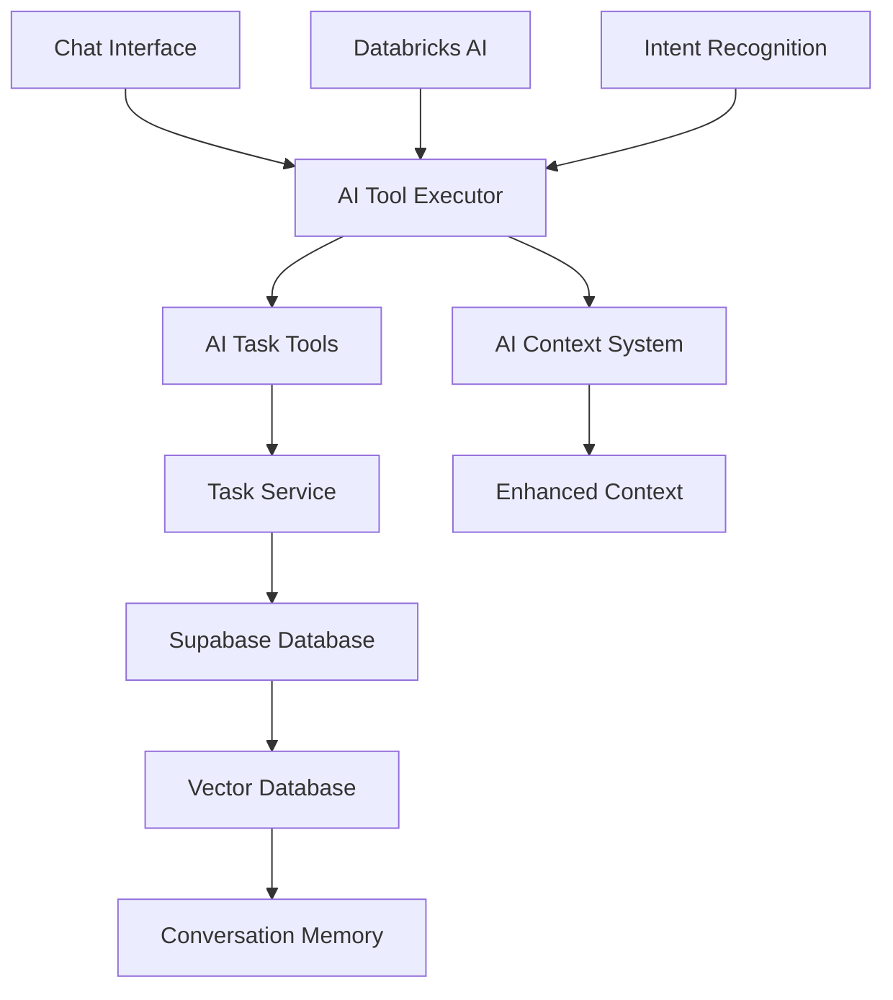

# Carole AI Personal Assistant - Memory Bank

**Project:** Carole (AI Personal Assistant)  
**Last Updated:** 2025-01-13  
**Status:** Phase 2.8 Complete - Production Ready

## Memory Bank Structure

This README serves as the **single source of truth** for project context. Additional specialized context files provide deeper detail:

- **`CHANGELOG.md`** - Version history and evolution (complete migration from docs)
- **`UX-PATTERNS.md`** - Interaction design patterns and user journey flows
- **`KNOWN-ISSUES.md`** - AI implementation problems and debugging solutions
- **`ARCHITECTURE.md`** - Technical decisions, codebase analysis, and future planning (includes BOSS UI strategy)

**🚨 Critical:** The docs folder is being deprecated. All essential information has been migrated here.

---

## Product Context

### Why This Project Exists

Carole is a proactive AI personal assistant that goes beyond reactive chat interfaces to actively manage tasks, priorities, and project workflows. The system learns user patterns and provides intelligent, contextual assistance for both personal and professional task management.

### Problems It Solves

- **Task Overwhelm**: Users struggle to prioritize and manage multiple competing tasks and projects
- **Context Loss**: Traditional task managers lack conversational memory and pattern recognition
- **Passive Tools**: Existing task managers require manual input without intelligent assistance
- **Priority Confusion**: Difficulty determining what to work on when facing multiple urgent tasks

### How It Should Work

- **Proactive AI**: AI proactively presents top 3 priorities immediately on app open
- **Natural Language**: Users interact through conversation, not forms - "I finished my training"
- **Pattern Learning**: AI learns user work patterns, energy cycles, and priority preferences
- **Goal-Aware**: AI connects daily tasks to larger goals and provides strategic guidance
- **Memory-Enabled**: Full conversation history preserved with semantic search capabilities

### User Experience Goals

- **Immediate Value**: Open app → see top 3 priorities → start working
- **Conversational**: Natural language for all task operations
- **Intelligent**: AI suggests optimizations, identifies patterns, prevents conflicts
- **Trustworthy**: Never fake responses - all AI claims must be backed by real actions
- **Adaptive**: System learns and adapts to user preferences over time

---

## System Patterns

### Architecture Overview



### Core Data Flow

1. **User Input**: Natural language message in chat interface
2. **Intent Analysis**: AI analyzes semantic intent (create/update/complete/query)
3. **Context Enrichment**: AI context system provides full task state awareness
4. **Tool Execution**: AI calls appropriate task tools with extracted parameters
5. **Database Operations**: Task service performs CRUD operations on Supabase
6. **User Feedback**: Clear confirmation messages with action results
7. **Memory Storage**: Conversation and context stored for future learning

### Key Technical Decisions

#### AI-Only Approach - No Hardcoded Business Logic

**Critical Architecture Decision**: All intent recognition, data extraction, and context resolution uses LLM intelligence, not hardcoded pattern matching.

- ✅ **LLM semantic understanding**: All intent analysis through actual AI models
- ❌ **No keyword matching**: No `messageLower.includes("need to")` logic
- ❌ **No regex patterns**: No hardcoded phrase detection
- ✅ **Honest failure handling**: When AI can't understand, ask for clarification

#### Never Fake Responses - Authenticity First

- ✅ **Real Actions Only**: If AI claims to do something, it must actually do it
- ✅ **Actual Data**: All responses based on real user data and tool results
- ❌ **No Placeholders**: Never use fake data, mock responses, or simulated actions

#### Document-Driven Development

- Comprehensive documentation as "north star" for all decisions
- Plan thoroughly, document decisions, refer back consistently
- Prevents scope creep and maintains project focus

### Component Relationships

#### AI Task Tools System

- **aiTaskTools.ts**: Core AI tool functions (CRUD operations, analysis)
- **aiToolExecutor.ts**: Tool execution engine with enhanced intent analysis
- **aiContext.ts**: Basic AI context system providing task state awareness
- **aiEnhancedContext.ts**: Advanced organizational and temporal context

#### Database Layer

- **taskService.js**: Database operations layer with full CRUD capabilities
- **supabase.js**: Database connection and configuration
- **Tasks table**: Core task storage with priority, status, tags, dependencies

#### UI Components

- **ChatInterface.svelte**: Main conversational interface
- **TaskDetailModal.svelte**: Full task editing with auto-save
- **Modal.svelte**: Reusable modal component
- **BOSS UI components**: Design system components (Button, Card, Badge, Input)

### Critical Implementation Paths

#### Natural Language Task Management

1. User: "I finished my AML training"
2. Intent Analysis: Semantic recognition identifies completion intent
3. Task Identification: AI finds matching task by content similarity
4. Status Update: AI calls changeTaskStatus tool
5. Confirmation: "✅ Marked 'AML Training' as complete"

#### Task Creation Flow

1. User: "I need to update the website by Friday"
2. Intent Analysis: Identifies creation intent with due date
3. Parameter Extraction: AI extracts title, due date, priority hints
4. Task Creation: AI calls createTask tool with extracted data
5. Confirmation: "✅ Created task: 'Update website' (Due: Friday, Priority: 7)"

#### Context-Aware Suggestions

1. AI Context System: Analyzes all tasks for patterns and blockers
2. Priority Analysis: Identifies high-priority items and dependencies
3. Optimization Suggestions: "These 3 tasks need the same research - group them?"
4. Proactive Insights: "You have 2 blocked tasks that need attention"

---

## Tech Context

### Technologies & Frameworks

#### Frontend Stack

- **SvelteKit**: v2.x - Main framework with TypeScript support
- **Tailwind CSS**: v3.4.0 - Styling with custom BOSS UI design system
- **Vite**: v6.x - Build tool and development server
- **TypeScript**: v5.x - Type safety and enhanced developer experience

#### Backend & Database

- **Supabase**: PostgreSQL database with Row Level Security
- **pgvector**: Vector database for semantic search and conversation memory
- **Databricks AI**: AI model endpoints (Claude 3.5 Sonnet, GPT-4o, Llama)

#### AI Integration

- **Databricks Service**: Company LLM infrastructure with PAT authentication
- **Enhanced Intent Recognition**: Semantic analysis preventing creation/completion conflicts
- **Tool Calling**: Structured AI function calling with proper error handling

### Development Environment Setup

#### Required Environment Variables

```env
# Supabase Configuration
VITE_SUPABASE_URL=https://your-project.supabase.co
VITE_SUPABASE_ANON_KEY=your_anon_key

# Databricks AI Configuration
VITE_DATABRICKS_HOST=https://databricks.internal.block.xyz
VITE_DATABRICKS_TOKEN=your_databricks_pat_token
VITE_DATABRICKS_ENV=development  # or 'production'
VITE_DEFAULT_AI_MODEL=claude-3-5-sonnet

# Development Settings
NODE_ENV=development
```

#### Key Development Commands

- `npm run dev` - Start development server (http://localhost:5174)
- `npm run build` - Build for production
- `npm run check` - TypeScript type checking
- `node test-connection-monitor.js` - Test Databricks connectivity

### Technical Constraints

#### AI Model Limitations

- Response time: 1-3 seconds for complex tool operations
- Context window: Limited conversation history requires smart context management
- Error handling: Retry logic with exponential backoff for service reliability

#### Database Constraints

- Row Level Security enforced for multi-tenant support
- Vector embeddings limited to 1536 dimensions (OpenAI standard)
- PostgreSQL array fields for tags and locations

#### Performance Requirements

- Task loading: <500ms for responsive UI
- Real-time updates: Optimistic UI updates with rollback on error
- Memory usage: Efficient context management for long conversations

### Core Dependencies

#### Production Dependencies

- `@supabase/supabase-js`: v2.x - Database client
- `svelte`: v4.x - Frontend framework
- `tailwindcss`: v3.4.0 - CSS framework
- `@tailwindcss/typography`: Typography plugin

#### Development Dependencies

- `@sveltejs/kit`: v2.x - SvelteKit framework
- `typescript`: v5.x - Type checking
- `vite`: v6.x - Build tool
- `autoprefixer`: CSS post-processing

### Tool Usage Patterns

#### Styling Architecture

- **BOSS UI Integration**: Custom CSS variables for consistent theming
- **Component Classes**: Reusable `.boss-button`, `.boss-card` etc.
- **Modular SCSS**: Separated utilities, components, layout styles
- **Responsive Design**: Mobile-first with desktop optimization

#### Error Handling Patterns

- **Retry Logic**: 3-attempt retry with exponential backoff
- **User Feedback**: Clear error messages with actionable suggestions
- **Graceful Degradation**: System remains functional with reduced AI capabilities
- **Logging**: Structured logging with request timing and error categorization

---

## Other Key Information

### API Documentation

#### Task Service API (taskService.js)

```javascript
// Core CRUD Operations
getTasks(): Promise<{success: boolean, data: Task[], error?: string}>
createTask(taskData: Partial<Task>): Promise<{success: boolean, data: Task, error?: string}>
updateTask(taskId: string, updates: Partial<Task>): Promise<{success: boolean, data: Task, error?: string}>
deleteTask(taskId: string): Promise<{success: boolean, error?: string}>

// Specialized Queries
getTopPriorityTasks(limit?: number): Promise<{success: boolean, data: Task[], error?: string}>
getTasksByStatus(status: TaskStatus): Promise<{success: boolean, data: Task[], error?: string}>
getBlockedTasks(): Promise<{success: boolean, data: Task[], error?: string}>
```

#### AI Task Tools API (aiTaskTools.ts)

```typescript
// Task Operations
searchTasks(query: string): Promise<Task[]>
createTask(taskData: Partial<Task>): Promise<Task>
updateTask(taskId: string, updates: Partial<Task>): Promise<Task>
markTaskComplete(taskId: string): Promise<Task>

// Intelligence Operations
analyzeTasks(): Promise<TaskAnalysis>
findSimilarTasks(taskId: string): Promise<Task[]>
optimizePriorities(): Promise<PriorityOptimization>
clusterTasks(): Promise<TaskCluster[]>
```

### Database Schema

#### Tasks Table Structure

```sql
CREATE TABLE tasks (
  id UUID PRIMARY KEY DEFAULT gen_random_uuid(),
  user_id UUID REFERENCES auth.users(id) ON DELETE CASCADE,

  -- Core Properties
  title TEXT NOT NULL,
  description TEXT,
  priority INTEGER CHECK (priority >= 0 AND priority <= 10) DEFAULT 5,
  status task_status DEFAULT 'todo',

  -- Enhanced Properties
  context_tags TEXT[] DEFAULT '{}',
  locations TEXT[] DEFAULT '{}',
  due_date TIMESTAMPTZ,
  time_estimate_hours DECIMAL(5,2),
  difficulty_level INTEGER CHECK (difficulty_level >= 0 AND difficulty_level <= 10) DEFAULT 5,

  -- Metadata
  created_at TIMESTAMPTZ DEFAULT NOW(),
  updated_at TIMESTAMPTZ DEFAULT NOW(),
  completed_at TIMESTAMPTZ
);

-- Status Workflow: backlog → todo → in_progress → done (with blocked from any active state)
CREATE TYPE task_status AS ENUM ('backlog', 'todo', 'in_progress', 'blocked', 'done');
```

#### Priority & Difficulty Scales

- **Priority (0-10)**: 0=none, 1-3=low, 4-6=medium, 7-8=high, 9-10=critical
- **Difficulty (0-10)**: 0=trivial, 1-3=easy, 4-6=moderate, 7-8=hard, 9-10=extremely hard

### Testing Strategy

#### Current Test Coverage

- Connection monitoring with `test-connection-monitor.js`
- Manual integration testing through chat interface
- Database operation testing through Supabase client

#### Planned Testing

- Unit tests for AI task tools functions
- Integration tests for end-to-end task operations
- UI component testing with Playwright/Vitest
- AI intent recognition accuracy testing

### Deployment Procedures

#### Production Environment

- Static site deployment (SvelteKit adapter-static)
- Environment variables configured for production Databricks endpoints
- Supabase database with production security policies
- SSL certificates and secure headers

#### Development Workflow

1. Local development with `npm run dev`
2. Feature testing with real database and AI integration
3. Type checking with `npm run check`
4. Build verification with `npm run build`
5. Deployment through static site hosting

### Historical Context & Evolution

#### Critical Lessons Learned

- **Environment Stability**: Development tools must be rock solid before feature development (Tailwind v4 → v3.4.0)
- **AI Authenticity**: Never fake responses - all AI claims must be backed by real actions
- **Incremental Complexity**: Build simple foundation first, add intelligence incrementally
- **Service Resilience**: External dependencies require retry logic and error handling
- **Stability over Bleeding Edge**: Prioritize working systems over latest features

#### Major Architecture Shifts

1. **Phase 1**: Basic web app with database persistence
2. **Phase 2**: AI integration with conversational interface
3. **Phase 2.8**: Production-quality UI with real-time task management
4. **Current**: Sophisticated AI tool system with semantic intent recognition

#### Known Problems Solved

- **Title Extraction**: AI was copying full prompts as titles instead of extracting meaningful content
- **Status Updates**: Operations claimed success but didn't actually update database
- **Intent Recognition**: "I finished X" was creating new tasks instead of marking existing ones complete
- **Service Reliability**: Intermittent 503 errors resolved with retry logic and connection monitoring

---

## Key Repository Folders and Files

### Core Application Files

- **`src/routes/+page.svelte`** - Main landing page with AI chat interface and priority dashboard
- **`src/routes/tasks/+page.svelte`** - Task browser and management interface
- **`src/routes/+layout.svelte`** - Global layout with navigation and connection status
- **`src/lib/components/ChatInterface.svelte`** - Main conversational AI interface
- **`src/lib/components/ConnectionStatus.svelte`** - Real-time service connectivity indicators

### AI System Files

- **`src/lib/aiTaskTools.ts`** - Core AI task operations (create, update, analyze, search)
- **`src/lib/aiToolExecutor.ts`** - Tool execution engine with intent recognition
- **`src/lib/aiContext.ts`** - AI context management and task state awareness
- **`src/lib/aiEnhancedContext.ts`** - Advanced organizational and temporal context
- **`src/lib/databricksService.ts`** - Databricks AI integration with multi-model support

#### Database & Services

- **`src/lib/taskService.js`** - Complete CRUD operations for task management
- **`src/lib/supabase.js`** - Database connection and configuration
- **`src/lib/database.sql`** - Complete PostgreSQL schema with RLS policies

#### UI Components

- **`src/lib/components/boss-ui/`** - BOSS design system components (Button, Card, Badge, Input)
- **`src/lib/components/task/`** - Task-specific UI components (modals, detail views)
- **`src/lib/components/ui/`** - Reusable UI components (Modal, ConfirmDialog, ContextMenu)

#### Configuration Files

- **`package.json`** - Dependencies, scripts, and project metadata
- **`svelte.config.js`** - SvelteKit configuration
- **`vite.config.js`** - Vite build configuration with proxy setup
- **`tailwind.config.js`** - Tailwind CSS configuration with BOSS UI integration
- **`postcss.config.js`** - PostCSS configuration for CSS processing

#### Development & Testing

- **`test-connection-monitor.js`** - Databricks service health testing and monitoring
- **`.env.example`** - Environment variable template for setup

#### Documentation (Being Deprecated)

- **`docs/`** - Traditional documentation folder being migrated to AI memory bank
- **`ai-memory/`** - AI-focused memory bank (this folder) with complete project context

---

## Critical Development Context from Documentation Migration

### Database Schema Details (from docs/database-schema.md)

**Tasks Table Architecture:**

```sql
-- Priority Scale: 0-10 (0=none, 1-3=low, 4-6=medium, 7-8=high, 9-10=critical)
-- Difficulty Scale: 0-10 (0=trivial, 1-3=easy, 4-6=moderate, 7-8=hard, 9-10=extremely hard)
-- Status Workflow: backlog → todo → in_progress → blocked → done
-- Array Fields: context_tags TEXT[], locations TEXT[]
-- Vector Support: search_vector tsvector for full-text search
-- Hierarchy: parent_task_id for subtask relationships
```

**Key Database Patterns:**

- Row Level Security (RLS) enforced for multi-tenant support
- PostgreSQL array fields for tags and locations (native support)
- Generated tsvector column for efficient full-text search
- UUID primary keys with cascading deletes for data integrity
- JSONB fields for flexible metadata storage

### Environment Setup Requirements (from docs/development-setup.md)

**Critical Environment Variables:**

```env
# Required for database operations
VITE_SUPABASE_URL=https://your-project.supabase.co
VITE_SUPABASE_ANON_KEY=your_anon_key

# Required for AI functionality
VITE_DATABRICKS_HOST=https://block-lakehouse-production.cloud.databricks.com
VITE_DATABRICKS_TOKEN=dapi-your-databricks-pat-token
VITE_DATABRICKS_ENV=production
VITE_DEFAULT_AI_MODEL=claude-3-5-sonnet
```

**Databricks PAT Token Setup:**

1. Access `https://block-lakehouse-production.cloud.databricks.com`
2. Navigate to Settings → Developer → Access tokens → Generate new token
3. Use comment: "Carole AI Assistant Local Development"
4. Recommended lifetime: 90 days
5. Copy token securely - never commit to repository

### Current Project Status & Roadmap (from docs/project-plan.md)

**Phase 2.8 Status - Current Development Priority:**

- **Enhanced Task UI**: Interactive task detail modals with auto-save functionality
- **Improved Task Filtering**: Better task browsing and organization capabilities
- **UI Polish**: Component refinements and user experience improvements
- **Timeline**: 1-2 weeks for essential daily usability improvements

**Phase 3 Preparation - Vector Integration:**

- Conversation memory persistence with pgvector
- Semantic search across task history and conversations
- Advanced context tracking and pattern recognition
- Long-term user preference learning

### User Experience Context (from docs/requirements.md)

**Core User Workflows:**

- **Priority Dashboard**: "Open app → see top 3 priorities → start working"
- **Natural Language Operations**: All task management through conversation
- **Conversational Context**: AI remembers task references across conversation turns
- **Proactive Insights**: AI suggests optimizations and identifies blockers

**AI Personality & Behavior Guidelines:**

- **Tone**: Observational ("I noticed...") not diagnostic ("You have a problem...")
- **Approach**: Helpful ("Want to try...") not prescriptive ("You should...")
- **Support**: Supportive ("Rough week?") not clinical language
- **Perfect Example**: "You've been mentioning feeling overwhelmed - want to focus on just one small win today?"
